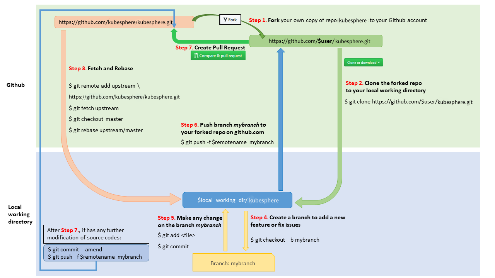

# Development Guide

This document walks you through how to get started developing KubeSphere and development workflow.

## Preparing the environment

### Go

KubeSphere development is based on [Kubernetes](https://github.com/kubernetes/kubernetes), both of them are written in [Go](http://golang.org/). If you don't have a Go development environment, please [set one up](http://golang.org/doc/code.html).

| Kubernetes     | requires Go |
|----------------|-------------|
| 1.13+          | >= 1.12     |

> Tips:
> - Ensure your GOPATH and PATH have been configured in accordance with the Go
environment instructions.
> - It's recommended to install [macOS GNU tools](https://www.topbug.net/blog/2013/04/14/install-and-use-gnu-command-line-tools-in-mac-os-x) for Mac OS.

### Docker

KubeSphere components are often deployed as containers in Kubernetes. If you need to rebuild the KubeSphere components in the Kubernetes cluster, you will need to [install Docker](https://docs.docker.com/install/).


### Dependency management

KubeSphere uses [Go Modules](https://github.com/golang/go/wiki/Modules) to manage dependencies in the `vendor/` tree.

#### Dependencies

[kubesphere/kubesphere](https://github.com/kubesphere/kubesphere) repository contains the source code . If you're looking for its dependent components, they live in their own repositories since they can be individual and universal.

- [Alert](https://github.com/kubesphere/alert): Alert is an enterprise-grade general-purpose high-performance alerting system.
- [Notification](https://github.com/openpitrix/notification): Notification is an enterprise-grade general-purpose high-performance notification system, it provides email notification service for KubeSphere currently.
- [OpenPitrix](https://github.com/openpitrix/openpitrix): Application management platform on multi-cloud environment, it provides application template and application management for KubeSphere currently.
- [SonarQube](https://github.com/SonarSource/sonarqube): Integrated in KubeSphere DevOps, it provides the capability to not only show health of an application but also to highlight issues newly introduced.

## Building KubeSphere on a local OS/shell environment

### For Quick Taste Binary

```bash
mkdir ks-tmp
cd ks-tmp
echo 'module kubesphere' > go.mod
echo 'replace (
        github.com/Sirupsen/logrus v1.4.1 => github.com/sirupsen/logrus v1.4.1
      	github.com/kiali/kiali => github.com/kubesphere/kiali v0.15.1-0.20190407071308-6b5b818211c3
      	github.com/kubernetes-sigs/application => github.com/kubesphere/application v0.0.0-20190518133311-b9d9eb0b5cf7
      )' >> go.mod

GO111MODULE=on go get kubesphere.io/kubesphere@d649e3d0bbc64bfba18816c904819e4850d021e0
GO111MODULE=on go build -o ks-apiserver kubesphere.io/kubesphere/cmd/ks-apiserver # build ks-apiserver
GO111MODULE=on go build -o ks-apigateway kubesphere.io/kubesphere/cmd/ks-apigateway # build ks-apigateway
GO111MODULE=on go build -o ks-controller-manager kubesphere.io/kubesphere/cmd/controller-manager # build ks-controller-manager
GO111MODULE=on go build -o ks-iam kubesphere.io/kubesphere/cmd/ks-iam # build ks-iam
```

### For Building KubeSphere Images

KubeSphere components are often deployed as a container in a kubernetes cluster, you may need to build a Docker image locally.

1. Clone repo to local

```bash
git clone https://github.com/kubesphere/kubesphere.git
```

2. Run Docker command to build image

```bash
# $REPO is the docker registry to push to
# $Tag is the tag name of the docker image
# The full go build process will be executed in the Dockerfile, so you may need to set GOPROXY in it.
docker build -f build/ks-apigateway/Dockerfile -t $REPO/ks-apigateway:$TAG .
docker build -f build/ks-apiserver/Dockerfile -t $REPO/ks-apiserver:$TAG .
docker build -f build/ks-iam/Dockerfile -t $REPO/ks-account:$TAG .
docker build -f build/ks-controller-manager/Dockerfile -t $REPO/ks-controller-manager:$TAG .
docker build -f ./pkg/db/Dockerfile -t $REPO/ks-devops:flyway-$TAG ./pkg/db/
```

### Test

In the development process, it is recommended to use local Kubernetes clusters, such as [minikube](https://kubernetes.io/docs/tasks/tools/install-minikube/), or to install an single-node [all-in-one](https://github.com/kubesphere/kubesphere#all-in-one) environment (Kubernetes-based) for quick testing.

> Tip: It also supports to use Docker for Desktop ships with Kubernetes as the test environment.

## Development Workflow



### 1 Fork in the cloud

1. Visit https://github.com/kubesphere/kubesphere
2. Click `Fork` button to establish a cloud-based fork.

### 2 Clone fork to local storage

Per Go's [workspace instructions](https://golang.org/doc/code.html#Workspaces), place KubeSphere' code on your `GOPATH` using the following cloning procedure.

1. Define a local working directory:

```bash
$ export working_dir=$GOPATH/src/kubesphere.io
$ export user={your github profile name}
```

2. Create your clone locally:

```bash
$ mkdir -p $working_dir
$ cd $working_dir
$ git clone https://github.com/$user/kubesphere.git
$ cd $working_dir/kubesphere
$ git remote add upstream https://github.com/kubesphere/kubesphere.git

# Never push to upstream master
$ git remote set-url --push upstream no_push

# Confirm that your remotes make sense:
$ git remote -v
```

### 3 Keep your branch in sync

```bash
git fetch upstream
git checkout master
git rebase upstream/master
```

### 4 Add new features or fix issues

Branch from it:

```bash
$ git checkout -b myfeature
```

Then edit code on the myfeature branch.

**Test and build**

Currently, make rules only contain simple checks such as vet, unit test, will add e2e tests soon.

**Using KubeBuilder**

- For Linux OS, you can download and execute this [KubeBuilder script](https://raw.githubusercontent.com/kubesphere/kubesphere/master/hack/install_kubebuilder.sh).

- For MacOS, you can install KubeBuilder by following this [guide](https://book.kubebuilder.io/quick-start.html).

**Run and test**

```bash
$ make all
# Run every unit test
$ make test
```

Run `make help` for additional information on these make targets.

### 5 Development in new branch

**Sync with upstream**

After the test is completed, suggest you to keep your local in sync with upstream which can avoid conflicts.

```
# Rebase your the master branch of your local repo.
$ git checkout master
$ git rebase upstream/master

# Then make your development branch in sync with master branch
git checkout new_feature
git rebase -i master
```
**Commit local changes**

```bash
$ git add <file>
$ git commit -s -m "add your description"
```

### 6 Push to your folk

When ready to review (or just to establish an offsite backup or your work), push your branch to your fork on github.com:

```
$ git push -f ${your_remote_name} myfeature
```

### 7 Create a PR

- Visit your fork at https://github.com/$user/kubesphere
- Click the` Compare & Pull Request` button next to your myfeature branch.
- Check out the [pull request process](pull-request.md) for more details and advice.


## CI/CD

KubeSphere uses [Travis CI](https://travis-ci.org/) as a CI/CD tool.

The components of KubeSphere need to be compiled and build include following:

`ks-apiserver, ks-controller-manager, ks-account, ks-apigateway, ks-devops`

After your PR is merged，Travis CI will compile the entire project and build the image, and push the image `kubespheredev/[component-name]:latest` to Dockerhub (e.g. `kubespheredev/ks-apiserver:latest`)

## API Reference

KubeSphere provides standard RESTFul API and detailed API documentations for developers, see [KubeSphere API Reference](https://docs.kubesphere.io/advanced-v2.0/zh-CN/api-reference/api-docs/) for more information.

## Code conventions

Please reference [Code conventions](https://github.com/kubernetes/community/blob/master/contributors/guide/coding-conventions.md) and follow with the rules.

**Note:**

> - All new packages and most new significant functionality must come with unit tests
> - Comment your code in English, see [Go's commenting conventions
](http://blog.golang.org/godoc-documenting-go-code)
