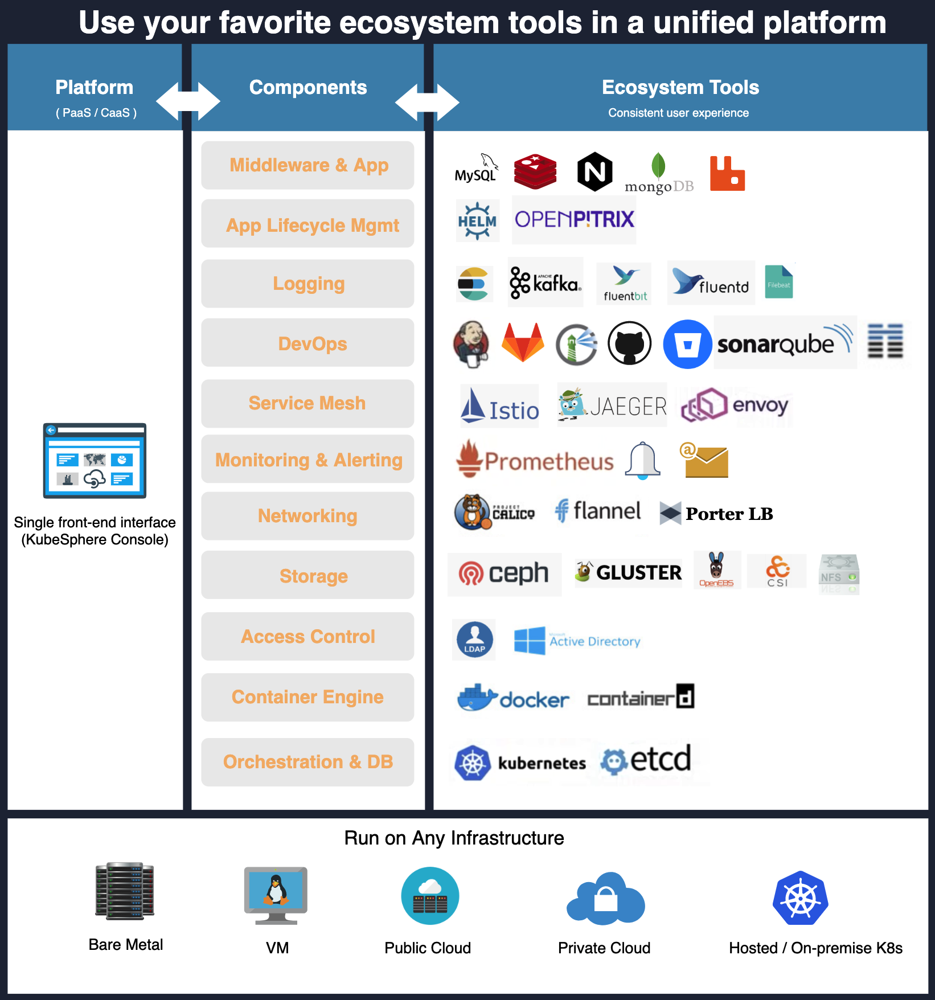

# KubeSphere Container Platform
[](https://github.com/KubeSphere/KubeSphere/blob/master/LICENSE)
[](https://travis-ci.org/kubesphere/kubesphere)
[](https://goreportcard.com/report/github.com/kubesphere/kubesphere)
[](https://github.com/kubesphere/kubesphere/releases/tag/v2.1.1)


----

## What is KubeSphere

> English | [中文](README_zh.md)

[KubeSphere](https://kubesphere.io/) is a multi-tenant enterprise-grade container platform built on [Kubernetes](http://kubernetes.io), with full-stack automated IT operation and streamlined DevOps workflows. KubeSphere provides developer-friendly wizard web UI, helping enterprises to build out a more robust and feature-rich platform, which includes most common functionalities needed for enterprise Kubernetes strategy, such as the **Kubernetes resource management, DevOps (CI/CD), application lifecycle management, monitoring, logging, Service Mesh (Istio-based), multi-tenancy, alerting and notification, storage and networking, autoscaling, access control, GPU support, etc.**, as well as **multi-cluster management, Network Policy, registry management, more security enhancements** in upcoming releases. KubeSphere is a **distributed operating system with cloud native stack** with Kubernetes as its kernel, and will be very well architected for **plug-and-play integration for third-party applications to boost its ecosystem**.

KubeSphere provides a complete user experience around Kubernetes that incorporates a set of cloud native ecosystem tools, allowing developers and DevOps teams use their favorite tools in a unified console. KubeSphere delivers **consolidated views while integrating a wide breadth of ecosystem tools** around Kubernetes and offers consistent user experience to reduce complexity. Most importantly, these functionalities are loosely coupled with the platform since they are pluggable and optional at your will. Last but not least, it does not change Kubernetes itself anything. In another word, KubeSphere can be deployed on any existing version-compatible Kubernetes cluster.




> Note: The [Screenshots](docs/en/guides/screenshots.md) give a close insight into KubeSphere, see [What is KubeSphere](https://kubesphere.io/docs/v2.1/en/introduction/what-is-kubesphere) for details.


<table>
  <tr>
      <td width="50%" align="center"><b>KubeSphere Dashboard</b></td>
      <td width="50%" align="center"><b>Project Resources</b></td>
  </tr>
  <tr>
     <td></td>
     <td></td>
  </tr>
  <tr>
      <td width="50%" align="center"><b>CI/CD Pipeline</b></td>
      <td width="50%" align="center"><b>Application Store</b></td>
  </tr>
  <tr>
     <td></td>
     <td></td>
  </tr>
</table>

## Demo Environment

Using the account `demo1 / Demo123` to log in the [demo environment](https://demo.kubesphere.io/). Please note the account is granted viewer access. You can also have a quick view of [KubeSphere Demo Video](https://youtu.be/u5lQvhi_Xlc).


## Features

|Feature|Description|
|---|---|
| Provisioning Kubernetes Cluster|Support deploy Kubernetes on your infrastructure out of box, including online and air gapped installation|
| Kubernetes Resource Management | Provide web console for creating and managing Kubernetes resources, with powerful observability including monitoring, logging, events, alerting and notification |
| DevOps System | Provide out-of-box CI/CD based on Jenkins, and offers automated workflow tools including binary-to-image (B2I) and source-to-image (S2I) |
| Application Store | Provide application store for Helm-based applications, and offers application lifecycle management |
| Service Mesh (Istio-based) | Provide fine-grained traffic management, observability and tracing for distributed microservice applications, provides visualization for traffic topology |
| Rich Observability | Provide multi-dimensional monitoring metrics, and provides multi-tenant log query and collection, support alerting and notification for both application and infrastructure |
| Multi-tenant Management | Provide unified authentication with fine-grained roles and three-tier authorization system, supports AD/LDAP authentication |
| Infrastructure Management | Support node management and monitoring, and supports adding new nodes for Kubernetes cluster |
| Storage Support | Support GlusterFS, CephRBD, NFS, Local (default) etc. open source storage solutions, provide CSI plugins to consume storage from cloud providers |
| Network Support | Support Calico, Flannel, etc. open source network solutions, provides load balancer plug-in [Porter](https://github.com/kubesphere/porter) for Kubernetes installed on physical machines |
| GPU Support | Support add GPU node, support vGPU, enables running ML applications on Kubernetes, e.g. TensorFlow |


> Note: See this [Feature and Benefits](https://kubesphere.io/docs/v2.1/en/introduction/features/) for further information.

----

## Architecture

KubeSphere uses a loosely-coupled architecture that separates the [frontend](https://github.com/kubesphere/console) from the [backend](https://github.com/kubesphere/kubesphere), the back end can also be connected with external systems through the REST API, all components are designed as Docker containers. See [Architecture](https://kubesphere.io/docs/v2.1/en/introduction/architecture/) for details.


## Latest Release

KubeSphere 2.1.1 was released on **February 23th, 2020**. See the [Release Notes For 2.1.1](https://kubesphere.io/docs/v2.1/en/release/release-v211/) for the updates.

## Installation

KubeSphere can run anywhere from on-premise datacenter to any cloud to edge. In addition, it can be deployed on any Kubernetes distribution.

### Deploy on Existing Kubernetes

**Prerequisites**

> - `Kubernetes version`： `1.15.x, 1.16.x, 1.17.x`
> - `Helm version` >= `2.10.0`，see [Install and Configure Helm in Kubernetes](https://devopscube.com/install-configure-helm-kubernetes/), (Helm v3 will be supported in KubeSphere 3.0.0)
> - An existing Storage Class in your Kubernetes cluster, use `kubectl get sc` to verify it
> - The CSR signing feature is activated in kube-apiserver, see [RKE installation issue](https://github.com/kubesphere/kubesphere/issues/1925#issuecomment-591698309).

Install KubeSphere using kubectl.

- If there are 1 Core and 2 GB RAM available in your cluster, use the command below to set up a default minimal installation only:

```bash
kubectl apply -f https://raw.githubusercontent.com/kubesphere/ks-installer/master/kubesphere-minimal.yaml
```

You can enable other components after installation, see [Pluggable components Installation](https://kubesphere.io/docs/v2.1/en/installation/pluggable-components/).

- If there are 8 Cores and 16 GB RAM available in your cluster, use the command below to install a complete KubeSphere, i.e. with all components enabled:

```bash
kubectl apply -f https://raw.githubusercontent.com/kubesphere/ks-installer/master/kubesphere-complete-setup.yaml
```

### Deploy on Linux

KubeSphere Installer can help you to install KubeSphere and Kubernetes on your linux machines. It provides [All-in-One](https://kubesphere.io/docs/v2.1/en/installation/all-in-one/) and [Multi-Node](https://kubesphere.io/docs/v2.1/en/installation/multi-node/) installation options.

**Minimum Requirements**

- Operating Systems
   - CentOS 7.5 (64 bit)
   - Ubuntu 16.04/18.04 LTS (64 bit)
   - Red Hat Enterprise Linux Server 7.4 (64 bit)
   - Debian Stretch 9.5 (64 bit)
- Hardware
   - CPU：2 Core,  Memory：4 G, Disk Space：100 G

##### All-in-One (QuickStart)

```bash
curl -L https://kubesphere.io/download/stable/latest > installer.tar.gz \
&& tar -zxf installer.tar.gz && cd kubesphere-all-v2.1.1/scripts
$ ./install.sh
```

Choose `"1) All-in-one"` to start the default minimal installation.

> Note: It's highly recommended to install [multi-node](https://kubesphere.io/docs/v2.1/en/installation/multi-node/) in production environment.

You can enable other components after installation, see [Pluggable Components Installation](https://kubesphere.io/docs/v2.1/en/installation/pluggable-components/).


## To start using KubeSphere

- KubeSphere Documentation ([En](https://kubesphere.io/docs/en/)/[中](https://kubesphere.io/docs/zh-CN/)）
- [API Documentation](https://kubesphere.io/docs/v2.1/en/api-reference/api-docs/)

## To start developing KubeSphere

The [development guide](CONTRIBUTING.md) hosts all information about building KubeSphere from source, git workflow, how to contribute code and how to test.

## RoadMap

Currently, KubeSphere has released the following 5 major editions. The future releases include multicluster, big data, AI, SDN, etc. See [Plans for 2.1.1 and 3.0.0](https://github.com/kubesphere/kubesphere/issues/1368) for more details.

**Express Edition** => **v1.0.x** => **v2.0.x**  => **v2.1.0** => **v2.1.1** => **v3.0.0**


## Landscapes

<p align="center">
<br/><br/>
&nbsp;&nbsp;&nbsp;&nbsp;
<br/><br/>
KubeSphere is a member of CNCF and a <a href="https://www.cncf.io/certification/software-conformance/#logos">Kubernetes Conformance Certified platform
</a>, which enriches the <a href="https://landscape.cncf.io/landscape=observability-and-analysis&license=apache-license-2-0">CNCF CLOUD NATIVE Landscape.
</a>
</p>

## Who Uses KubeSphere

The [Powered by KubeSphere](docs/powered-by-kubesphere.md) page includes users list of the project. You can submit your institution name and homepage if you are using KubeSphere.


## Support, Discussion, and Community

If you need any help with KubeSphere, please join us at [Slack Channel](https://join.slack.com/t/kubesphere/shared_invite/enQtNTE3MDIxNzUxNzQ0LTZkNTdkYWNiYTVkMTM5ZThhODY1MjAyZmVlYWEwZmQ3ODQ1NmM1MGVkNWEzZTRhNzk0MzM5MmY4NDc3ZWVhMjE).

Please submit any KubeSphere bugs, issues, and feature requests to [KubeSphere GitHub Issue](https://github.com/kubesphere/kubesphere/issues).

## Contributing to the project

This [document](docs/en/guides/README.md) walks you through how to get started contributing KubeSphere.
