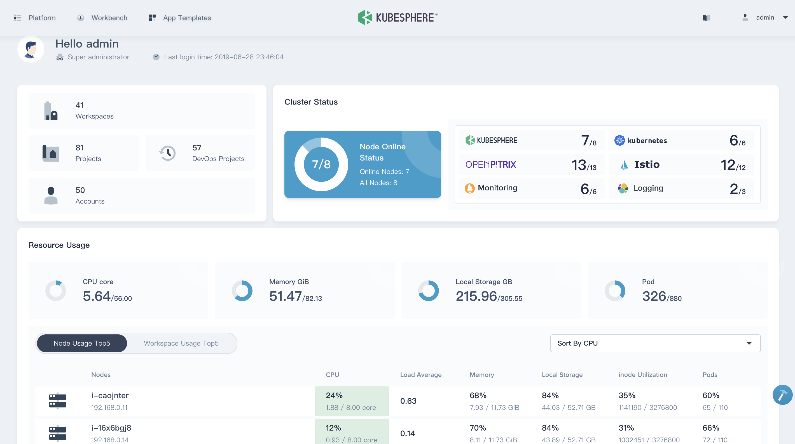
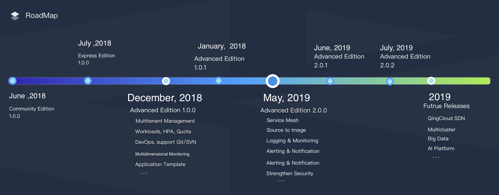

# KubeSphere
[](https://github.com/KubeSphere/KubeSphere/blob/master/LICENSE)
[](https://travis-ci.org/kubesphere/kubesphere)
[](https://github.com/kubesphere/kubesphere/releases/tag/advanced-2.0.2)


----

## What is KubeSphere

> English | [中文](README_zh.md)

[KubeSphere](https://kubesphere.io/) is an enterprise-grade multi-tenant container management platform that built on [Kubernetes](https://kubernetes.io). It provides an easy-to-use UI for users to manage computing resources with a few clicks, which reduces the learning curve and empowers the DevOps teams. It greatly reduces the complexity of the daily work of development, testing, operation and maintenance, aiming to alleviate the pain points of Kubernetes' storage, network, security and ease of use, etc.

> See this [document](https://docs.kubesphere.io/advanced-v2.0/zh-CN/introduction/intro/) that describes the KubeSphere landscape and details.



## Features

KubeSphere Advanced Edition 2.0.2 provides an easy-to-use console with the awesome user experience that allows you to quickly get started with a container management platform. KubeSphere provides and supports following core features:


- Workload management
- Service mesh (Istio-based)
- DevOps
- Source to Image
- Multi-tenant management
- Multi-dimensional and Multi-tenant Monitoring, Logging, Alerting, Notification
- Service and network management
- Application template and repository
- Infrastructure management, image registry management
- Integrate Harbor and GitLab
- LB controller for Kubernetes on bare metal ([Porter](https://github.com/kubesphere/porter)), [cloud LB plugin](https://github.com/yunify/qingcloud-cloud-controller-manager)
- Support GPU node


It also supports multiple open source storage and high-performance cloud storage as the persistent storage services, as well as supports multiple open source network plugins.

> Note:
> - See the [Screenshots](docs/screenshots.md) of KubeSphere to have a most intuitive understanding of KubeSphere dashboard and features.
> - See this [document](https://docs.kubesphere.io/advanced-v2.0/zh-CN/introduction/features/) that elaborates on the KubeSphere features and services from a professional point of view.

----

## Architecture

KubeSphere adopts the separation of front and back ends, each component is drawn in the architecture diagram below. KubeSphere can run anywhere from on-premise datacenter to any cloud to edge. In addition, it can be deployed on any Kubernetes distribution.


## Latest Release

KubeSphere Advanced Edition 2.0.2 was released on **July 9th, 2019**. See the [Release Notes For 2.0.2](https://docs.kubesphere.io/advanced-v2.0/zh-CN/release/release-v202/) to preview the updates.

## Installation

### Deploy On Kubernetes

You can deploy KubeSphere on any Kubernetes cluster，please refer to [KubeSphere on Kubernetes](https://github.com/kubesphere/ks-installer).

### Deploy on Linux

- Operating Systems
   - CentOS 7.5 (64 bit)
   - Ubuntu 16.04/18.04 LTS (64 bit)
   - Red Hat Enterprise Linux Server 7.4 (64 bit)
   - Debian Stretch 9.5 (64 bit)
- Hardware
   - CPU：8 Core,  Memory：16 G, Disk Space：100 G

### All-in-One

[All-in-One](https://docs.kubesphere.io/advanced-v2.0/zh-CN/installation/all-in-one/): For those who are new to KubeSphere and looking for the fastest way to install and experience the dashboard. Execute following commands to download and install KubeSphere in a single node.

```bash
$ curl -L https://kubesphere.io/download/stable/advanced-2.0.2 > advanced-2.0.2.tar.gz \
&& tar -zxf advanced-2.0.2.tar.gz && cd ./kubesphere-all-advanced-2.0.2/scripts
$ ./install.sh
```

Choose `"1) All-in-one"` to trigger the installation. Generally, you can install it directly without any configuration. For details please reference [All-in-One](https://docs.kubesphere.io/advanced-v2.0/zh-CN/installation/all-in-one/).

> Note: 
> - In a formal environment, it's highly recommended to install KubeSphere with [Multi-Node Installation](https://docs.kubesphere.io/advanced-v2.0/zh-CN/installation/multi-node/).
> - Click [here](https://asciinema.org/~lilin) to preview the installation demo.

## To start using KubeSphere

### Quick Start

The [Quick Start Guide](https://docs.kubesphere.io/advanced-v2.0/quick-start/admin-quick-start/) provides 12 quick-start tutorials to walk you through the process and common manipulation in KubeSphere, with a quick overview of the core features of KubeSphere that helps you to get familiar with it.

### Documentation

- [KubeSphere Documentation (En/中) ](https://docs.kubesphere.io/)
- [KubeSphere Documentation (PDF)](https://docs.kubesphere.io/KubeSphere-advanced-v2.0.pdf)
- [API Documentation](https://kubesphere.io/docs/advanced-v2.0/zh-CN/api-reference/api-docs/)


## To start developing KubeSphere

The [development guide](CONTRIBUTING.md) hosts all information about building KubeSphere from source, git workflow, how to contribute code and how to test.

## RoadMap

Currently, KubeSphere has released the following 4 major editions. The future releases will include Big data, AI, Multicluster, QingCloud SDN, etc.

**Community Edition** => **Express Edition** => **Advanced Edition 1.0.0** => **Advanced Edition 2.0.x**




## Support, Discussion, and Community

If you need any help with KubeSphere, please join us at [Slack Channel](https://join.slack.com/t/kubesphere/shared_invite/enQtNTE3MDIxNzUxNzQ0LTZkNTdkYWNiYTVkMTM5ZThhODY1MjAyZmVlYWEwZmQ3ODQ1NmM1MGVkNWEzZTRhNzk0MzM5MmY4NDc3ZWVhMjE).

Please submit any KubeSphere bugs, issues, and feature requests to [KubeSphere GitHub Issue](https://github.com/kubesphere/kubesphere/issues).

## Contributing to the project

All members of the KubeSphere community must abide by [Code of Conduct](docs/code-of-conduct.md). Only by respecting each other can we develop a productive, collaborative community.

How to submit a pull request to KubeSphere? See [Pull Request Instruction](docs/pull-requests.md).


