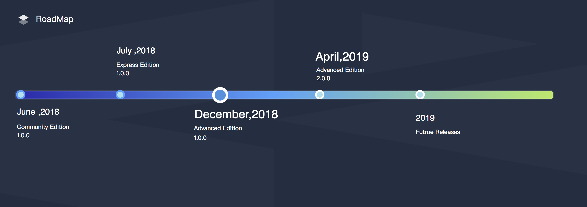

# KubeSphere

----

## What is KubeSphere

[KubeSphere](https://kubesphere.io/) is an enterprise-grade multi-tenant container management platform that built on [Kubernetes](https://kubernetes.io). It provides an easy-to-use UI enables creation of computing resources with a few clicks and one-click deployment, which reduces the learning curve and empower the DevOps teams. It greatly reduces the complexity of the daily work of development, testing, operation and maintenance, aiming to solve the pain spots of Kubernetes' storage, network, security and ease of use, etc.

> See this [document](https://docs.kubesphere.io/advanced-v1.0/en/introduction/intro/) that describes the KubeSphere landscape and details.

## Features

KubeSphere provides an easy-to-use console with the awesome user experience that allows you to quickly get started with a container management platform. KubeSphere provides and integrates workload management, DevOps Delivery, multi-tenant management, multi-dimensional monitoring, service and network management, application scheduling, infrastructure management, image registry management, etc. It also supports multiple open source storage and high-performance cloud storage as the persistent storage services.

> See this [document](https://docs.kubesphere.io/advanced-v1.0/en/introduction/features/) that elaborates on the KubeSphere features and services from a professional point of view.

----

## Installation

KubeSphere installation supports following 2 kinds of installation:

- [All-in-One](https://docs.kubesphere.io/advanced-v1.0/en/installation/all-in-one/): For those who are new to KubeSphere and looking for the fastest way to install and experience the dashboard, the all-in-one installation must be your best choice since it supports one-click installation.
- [Multi-Node](../https://docs.kubesphere.io/advanced-v1.0/en/installation/multi-node/): Multi-node is used for installing KubeSphere on multiple instances, supports for installing a highly available master and etcd cluster which is able to use in a formal environment.
- For Chinese version, see [KubeSphere Installation Guide (安装指南) ](https://docs.kubesphere.io/advanced-v1.0/zh-CN/installation/intro/).

### Minimum Requirements

- perating Systems
   - CentOS 7.5 (64 bit)
   - Ubuntu 16.04/18.04 LTS (64 bit)
   - Red Hat Enterprise Linux Server 7.4 (64 bit)
   - Debian Stretch 9.5 (64 bit)
- Hardware
   -CPU：4 Core,  Memory：8 G, Disk Space：100 G

## Quick Start

The [Quick Start Guide](https://docs.kubesphere.io/advanced-v1.0/en/quick-start/admin-quick-start/) provides 7 quick-start examples to walk you through the process and common manipulation in KubeSphere, with a quick overview of the basic features of KubeSphere that helps you to get familiar with it. 

## Latest Release

KubeSphere Advanced Edition 1.0.1 was released on **January 28th, 2019**. See the [Release Notes For 1.0.1](https://docs.kubesphere.io/advanced-v1.0/en/release/release-v101/) to preview the updates.

## RoadMap

Currently, KubeSphere has released the following three major editions. Advanced Edition 2.0.0 will be released on April 18, 2019. The 2.0.0 release will include microservice governance, log query and collection, alerting, S2i, code continuous inspection (SonarQube), quota management for workspace, improve security performance, GPU support, as well as providing [Porter](https://github.com/kubesphere/porter), which is a load balancer for bare metal Kubernetes clusters.

**Community Edition** => **Express Edition** => **Advanced Edition**

## Documentation

- [KubeSphere Documentation (En/中) ](https://docs.kubesphere.io/)
- [KubeSphere Docementation (PDF)](https://docs.kubesphere.io/KubeSphere-advanced-v1.0.pdf)

## Support, Discussion, and Community

If you need any help with KubeSphere, please join us at [Slack channel](http://kubesphere.slack.com/) where most of our team hangs out at.

Please submit any KubeSphere bugs, issues, and feature requests to [KubeSphere GitHub Issue](https://github.com/kubesphere/kubesphere/issues).

## Contributing to the project

All members of the KubeSphere community must abide by [Code of Conduct](docs/code-of-conduct.md). Only by respecting each other can we develop a productive, collaborative community.

How to submit a pull request to KubeSphere? See [Pull Request Instruction](docs/pull-requests.md).

You can then find out more detail [here](docs/welcome-to-KubeSphere-new-developer-guide.md).

