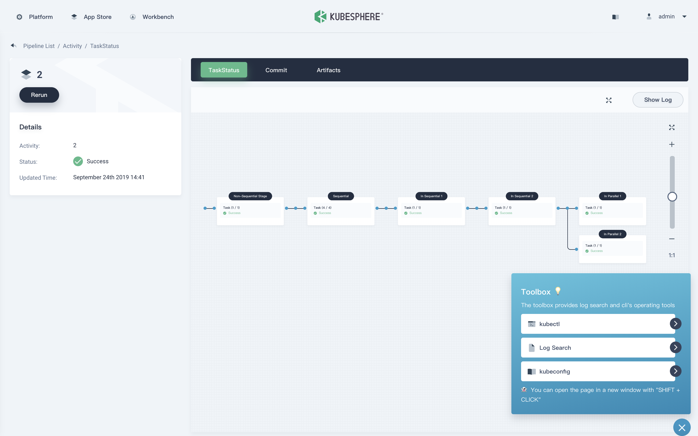
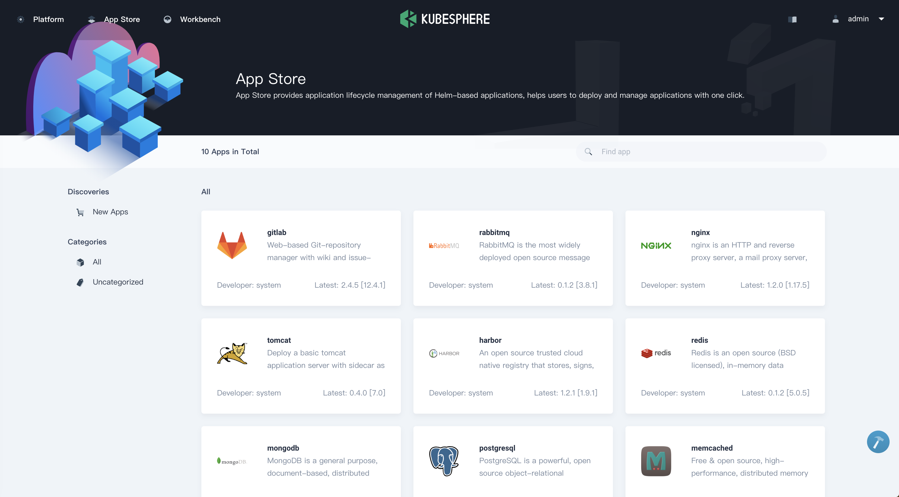

# KubeSphere Container Platform

[](https://github.com/KubeSphere/KubeSphere/blob/master/LICENSE)
[](https://travis-ci.org/kubesphere/kubesphere)
[](https://goreportcard.com/report/github.com/kubesphere/kubesphere)
[](https://github.com/kubesphere/kubesphere/releases/tag/v2.1.1)


----

## What is KubeSphere

> English | [中文](README_zh.md)

[KubeSphere](https://kubesphere.io/) is a **distributed operating system providing cloud native stack** with [Kubernetes](https://kubernetes.io) as its kernel, and aims to be plug-and-play architecture for third-party applications seamless integration to boost its ecosystem. KubeSphere is also a multi-tenant enterprise-grade container platform with full-stack automated IT operation and streamlined DevOps workflows. It provides developer-friendly wizard web UI, helping enterprises to build out a more robust and feature-rich platform, which includes most common functionalities needed for enterprise Kubernetes strategy, see [Feature List](#features) for details.

The following screenshots give a close insight into KubeSphere. Please check [What is KubeSphere](https://kubesphere.io/docs/introduction/what-is-kubesphere/) for further information.

<table>
  <tr>
      <td width="50%" align="center"><b>Workbench</b></td>
      <td width="50%" align="center"><b>Project Resources</b></td>
  </tr>
  <tr>
     <td></td>
     <td></td>
  </tr>
  <tr>
      <td width="50%" align="center"><b>CI/CD Pipeline</b></td>
      <td width="50%" align="center"><b>App Store</b></td>
  </tr>
  <tr>
     <td></td>
     <td></td>
  </tr>
</table>

## Demo Environment

Using the account `demo1 / Demo123` to log in the [demo environment](https://demo.kubesphere.io/). Please note the account is granted view access. You can also have a quick view of [KubeSphere Demo Video](https://youtu.be/u5lQvhi_Xlc).

## Architecture

KubeSphere uses a loosely-coupled architecture that separates the [frontend](https://github.com/kubesphere/console) from the [backend](https://github.com/kubesphere/kubesphere). External systems can access the components of the backend which are delivered as Docker containers through the REST APIs. See [Architecture](https://kubesphere.io/docs/introduction/architecture/) for details.


## Features

|Feature|Description|
|---|---|
| Provisioning Kubernetes Cluster|Support deploy Kubernetes on your infrastructure out of box, including online and air gapped installation|
| Kubernetes Resource Management | Provide web console for creating and managing Kubernetes resources, with powerful observability including monitoring, logging, events, alerting and notification |
| DevOps System | Provide out-of-box CI/CD based on Jenkins, and offers automated workflow tools including binary-to-image (B2I) and source-to-image (S2I) |
| Application Store | Provide application store for Helm-based applications, and offers application lifecycle management |
| Service Mesh (Istio-based) | Provide fine-grained traffic management, observability and tracing for distributed microservice applications, provides visualization for traffic topology |
| Rich Observability | Provide multi-dimensional monitoring metrics, and provides multi-tenant log query and collection, support alerting and notification for both application and infrastructure |
| Multi-tenant Management | Provide unified authentication with fine-grained roles and three-tier authorization system, supports AD/LDAP authentication |
| Infrastructure Management | Support node management and monitoring, and supports adding new nodes for Kubernetes cluster |
| Storage Support | Support GlusterFS, CephRBD, NFS, Local (default) etc. open source storage solutions, provide CSI plugins to consume storage from cloud providers |
| Network Support | Support Calico, Flannel, etc. open source network solutions, provides load balancer plug-in [Porter](https://github.com/kubesphere/porter) for Kubernetes installed on physical machines |
| GPU Support | Support add GPU node, support vGPU, enables running ML applications on Kubernetes, e.g. TensorFlow |

Please See the [Feature and Benefits](https://kubesphere.io/docs/introduction/features/) for further information.

----

## Latest Release

KubeSphere 2.1.1 was released on **February 23rd, 2020**. See the [Release Notes For 2.1.1](https://kubesphere.io/docs/release/release-v211/) for the updates.

## Installation

KubeSphere can run anywhere from on-premise datacenter to any cloud to edge. In addition, it can be deployed on any version-compatible running Kubernetes cluster.

### Deploy on Existing Kubernetes Cluster

#### Prerequisites

- `Kubernetes version`： `1.15.x, 1.16.x, 1.17.x`
- `2.10.0 ≤ Helm Version ＜ 3.0.0` excluding 2.16.0 because of [#6894](https://github.com/helm/helm/issues/6894). Please see [Install and Configure Helm in Kubernetes](https://devopscube.com/install-configure-helm-kubernetes/). Helm v3 will be supported in KubeSphere 3.0.0.
- An existing Storage Class in your Kubernetes cluster, use `kubectl get sc` to verify it
- The CSR signing feature is activated in kube-apiserver, see [RKE installation issue](https://github.com/kubesphere/kubesphere/issues/1925#issuecomment-591698309).

Install KubeSphere using kubectl.

- If there are 1 Core and 2 GB RAM available in your cluster, use the command below to set up a default minimal installation only. You can enable other components after installation if more resource added in later on. See [Pluggable Components Installation](https://kubesphere.io/docs/installation/pluggable-components/) for detailed information.

```bash
kubectl apply -f https://raw.githubusercontent.com/kubesphere/ks-installer/master/kubesphere-minimal.yaml
```

- If there are 8 Cores and 16 GB RAM available in your cluster, use the command below to install a complete KubeSphere, i.e. with all components enabled:

```bash
kubectl apply -f https://raw.githubusercontent.com/kubesphere/ks-installer/master/kubesphere-complete-setup.yaml
```

Wait the installation logs using the following command till showing `"Successful"`, then you can log in the console using the default username and password.

```bash
kubectl logs -n kubesphere-system $(kubectl get pod -n kubesphere-system -l app=ks-install -o jsonpath='{.items[0].metadata.name}') -f
```

### Deploy on Linux

KubeSphere Installer can help you to install KubeSphere and Kubernetes on your linux machines. It provides [All-in-One](https://kubesphere.io/docs/installation/all-in-one/) and [Multi-Node](https://kubesphere.io/docs/installation/multi-node/) installation options.

#### Minimum Requirements

- Operating Systems
  - CentOS 7.4~7.7 (64 bit)
  - Ubuntu 16.04/18.04 LTS (64 bit)
  - Red Hat Enterprise Linux Server 7.4 (64 bit)
  - Debian Stretch 9.5 (64 bit)
- Hardware
  - CPU：2 Cores,  Memory：4 GB, Disk Space：100 GB

> Note:  Please disable the firewall, or ensure your firewall meets the [port requirements](https://kubesphere.io/docs/installation/port-firewall/).

#### All-in-One (QuickStart)

```bash
curl -L https://kubesphere.io/download/stable/latest > installer.tar.gz \
&& tar -zxf installer.tar.gz && cd kubesphere-all-v2.1.1/scripts
$ ./install.sh
```

Choose `"1) All-in-one"` to start the default minimal installation.

You can enable other components after installation, see [Pluggable Components Installation](https://kubesphere.io/docs/installation/pluggable-components/).

## To start using KubeSphere

- KubeSphere Documentation ([En](https://kubesphere.io/docs/)/[中](https://kubesphere.io/docs/zh-CN/)）
- [API Documentation](https://kubesphere.io/docs/api-reference/api-docs/)

## Contributing, Support, Discussion, and Community

This [community](https://github.com/kubesphere/community) walks you through how to get started contributing KubeSphere. The [development guide](https://github.com/kubesphere/community/tree/master/developer-guide/development) explains how to set up development environment.

If you need any help with KubeSphere, please join us at [Slack Channel](https://join.slack.com/t/kubesphere/shared_invite/enQtNTE3MDIxNzUxNzQ0LTZkNTdkYWNiYTVkMTM5ZThhODY1MjAyZmVlYWEwZmQ3ODQ1NmM1MGVkNWEzZTRhNzk0MzM5MmY4NDc3ZWVhMjE).

We also communicate through [Google Group](https://groups.google.com/forum/#!forum/kubesphere).

Please submit any KubeSphere bugs, issues, and feature requests to [KubeSphere GitHub Issue](https://github.com/kubesphere/kubesphere/issues).

## Who are using KubeSphere

The [Powered by KubeSphere](https://kubesphere.io/case/) page includes the user list of the project. You can submit your institution name and homepage if you are using KubeSphere.

## RoadMap

Currently, KubeSphere has released the following 5 major editions. The future releases include multicluster, big data, AI, SDN, etc. See [Plans for 2.1.1 and 3.0.0](https://github.com/kubesphere/kubesphere/issues/1368) for more details.

**Express Edition** => **v1.0.x** => **v2.0.x**  => **v2.1.0** => **v2.1.1** => **v3.0.0**


## Landscapes

<p align="center">
<br/><br/>
&nbsp;&nbsp;&nbsp;&nbsp;
<br/><br/>
KubeSphere is a member of CNCF and a <a href="https://www.cncf.io/certification/software-conformance/#logos">Kubernetes Conformance Certified platform
</a>, which enriches the <a href="https://landscape.cncf.io/landscape=observability-and-analysis&license=apache-license-2-0">CNCF CLOUD NATIVE Landscape.
</a>
</p>
