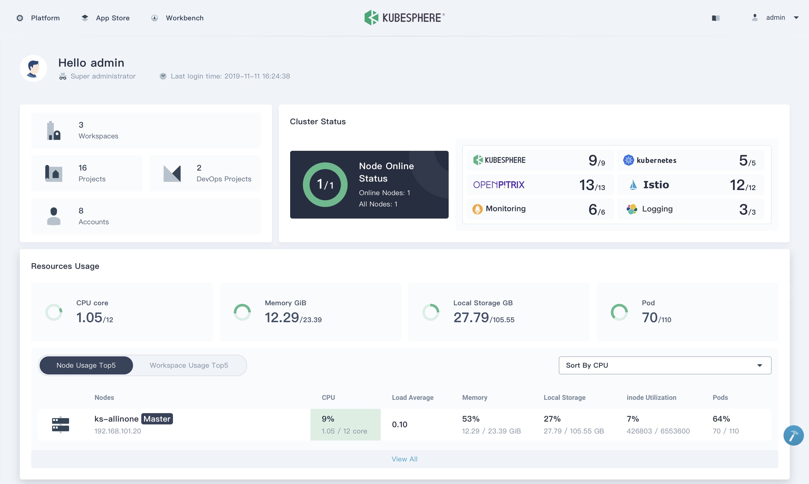
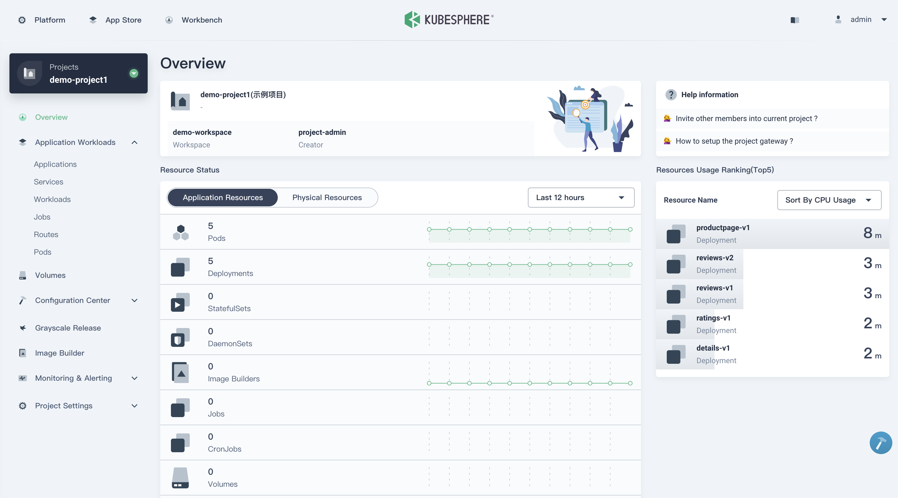
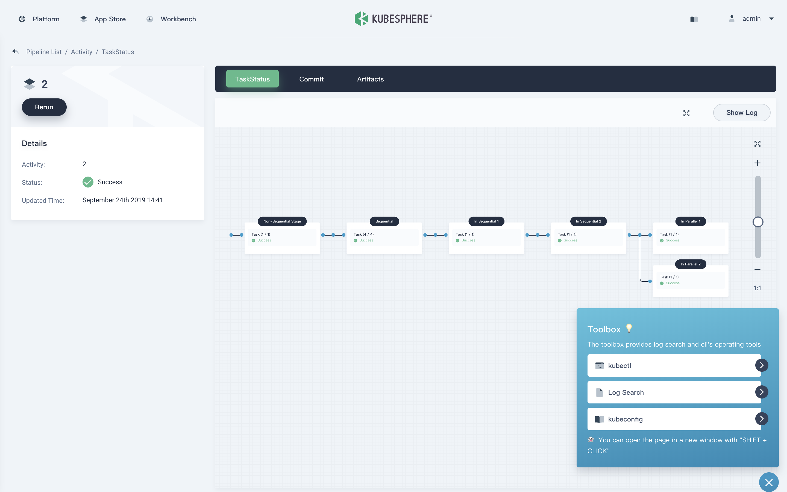
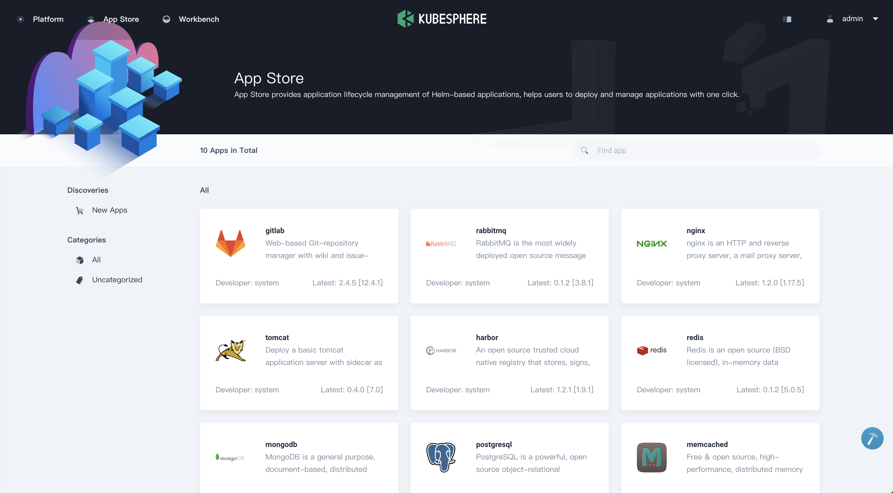
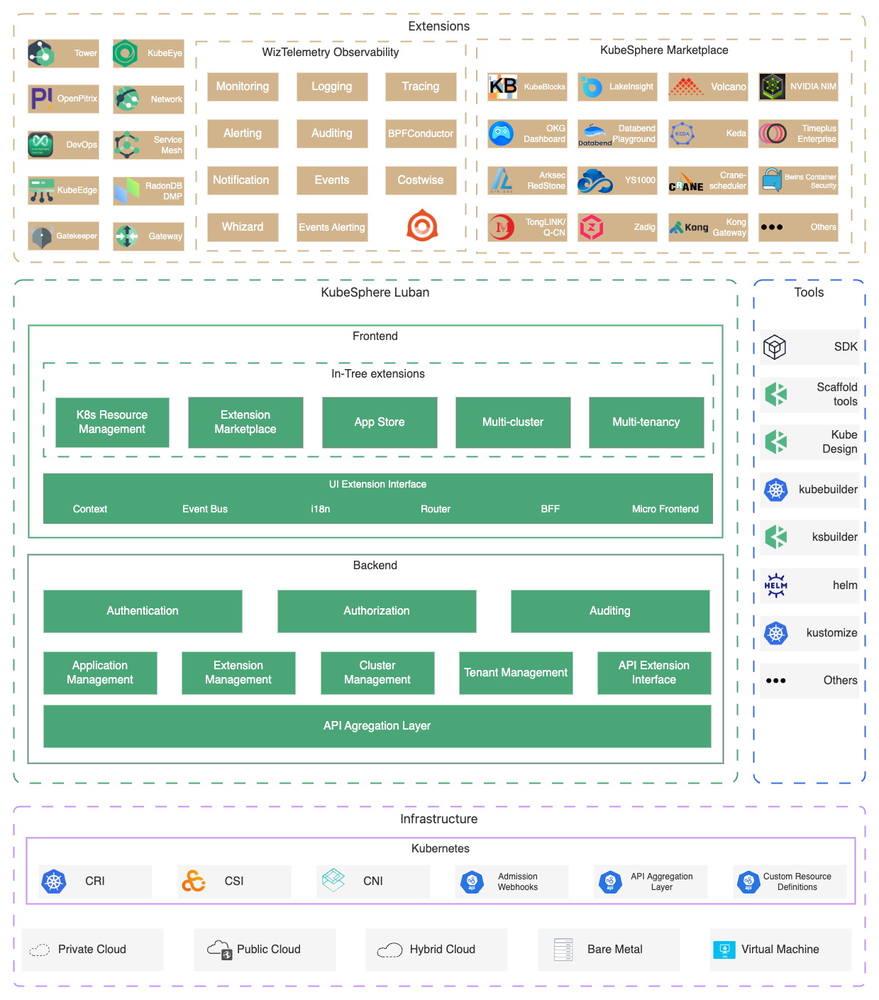

<p align="center">
<a href="https://kubesphere.com.cn/"></a>
</p>

<p align="center">
<b>适用于<i> Kubernetes 多云、数据中心和边缘 </i>管理的容器平台</b>
</p>

<p align=center>
<a href="https://goreportcard.com/report/github.com/kubesphere/kubesphere"></a>
<a href="https://hub.docker.com/r/kubesphere/ks-installer"></a>
<a href="https://github.com/search?q=user%3Akubesphere+user%3Akubesphere-sigs+label%3A%22good+first+issue%22+state%3Aopen&type=Issues&ref=advsearch&l=&l="></a>
<a href="https://twitter.com/intent/follow?screen_name=KubeSphere"></a>
<a href="https://join.slack.com/t/kubesphere/shared_invite/enQtNTE3MDIxNzUxNzQ0LTZkNTdkYWNiYTVkMTM5ZThhODY1MjAyZmVlYWEwZmQ3ODQ1NmM1MGVkNWEzZTRhNzk0MzM5MmY4NDc3ZWVhMjE"></a>
<a href="https://www.youtube.com/channel/UCyTdUQUYjf7XLjxECx63Hpw"></a>
</p>


----

## KubeSphere 是什么

> [English](README.md) | 中文

[KubeSphere](https://kubesphere.io/zh/) 愿景是打造一个以 [Kubernetes](https://kubernetes.io/zh/) 为内核的 **云原生分布式操作系统**，它的架构可以非常方便地使第三方应用与云原生生态组件进行即插即用（plug-and-play）的集成，支持云原生应用在多云与多集群的统一分发和运维管理。 KubeSphere 也是一个多租户容器平台，提供全栈的 IT 自动化运维的能力，简化企业的 DevOps 工作流。KubeSphere 提供了运维友好的向导式操作界面，帮助企业快速构建一个强大和功能丰富的容器云平台，详情请参阅 [平台功能](#平台功能) 。

下面的屏幕截图让我们进一步了解 KubeSphere，关于 KubeSphere 更详细的介绍与说明请参阅 [什么是 KubeSphere](https://kubesphere.io/zh/docs/introduction/what-is-kubesphere/) 。

<table>
  <tr>
      <td width="50%" align="center"><b>工作台</b></td>
      <td width="50%" align="center"><b>项目资源</b></td>
  </tr>
  <tr>
     <td></td>
     <td></td>
  </tr>
  <tr>
      <td width="50%" align="center"><b>CI/CD 流水线</b></td>
      <td width="50%" align="center"><b>应用商店</b></td>
  </tr>
  <tr>
     <td></td>
     <td></td>
  </tr>
</table>

## Demo 环境

🎮 使用账号 `demo1 / Demo123` 登录 [Demo 环境](https://demo.kubesphere.io/) 。请注意，该帐户仅授予了 view 权限。

🖥 您还可以快速查看[Demo 视频](https://youtu.be/YxZ1YUv0CYs) 。

## 平台功能

<details>
  <summary><b>🕸 部署 Kubernetes 集群</b></summary>
  支持在任何基础设施上部署 Kubernetes，支持在线安装和离线安装，<a href="https://kubesphere.io/zh/docs/installing-on-linux/introduction/intro/">了解更多</a>。
  </details>

<details>
  <summary><b>🔗 Kubernetes 多集群管理</b></summary>
  提供集中控制平台来管理多个 Kubernetes 集群，支持将应用程序发布到跨不同云供应商的多个 k8s 集群上。
  </details>

<details>
  <summary><b>🤖 Kubernetes DevOps</b></summary>
  提供开箱即用的基于 Jenkins 的 CI/CD，并内置自动化流水线插件，包括 Binary-to-Image (B2I) 和 Source-to-Image (S2I)，<a href="https://kubesphere.io/zh/devops/">了解更多</a>。
  </details>

<details>
  <summary><b>🔎 云原生可观测性</b></summary>
  支持多维度监控、事件和审计日志；内置多租户日志查询和收集，告警和通知，<a href="https://kubesphere.io/zh/observability/">了解更多</a>。
  </details>

<details>
  <summary><b>🧩 基于 Istio 的微服务治理</b></summary>
  为分布式微服务应用程序提供细粒度的流量管理、可观测性和服务跟踪，支持可视化的流量拓扑，<a href="https://kubesphere.io/zh/service-mesh/">了解更多</a>。
  </details>

<details>
  <summary><b>💻 应用商店</b></summary>
  为基于 Helm 的应用程序提供应用商店，并在 Kubernetes 平台上提供应用程序生命周期管理功能，<a href="https://kubesphere.io/zh/docs/pluggable-components/app-store/">了解更多</a>。
  </details>

<details>
  <summary><b>💡 Kubernetes 边缘节点管理</b></summary>
  基于 <a href="https://kubeedge.io/zh/">KubeEdge</a> 实现应用与工作负载在云端与边缘节点的统一分发与管理，解决在海量边、端设备上完成应用交付、运维、管控的需求，<a href= "https://kubesphere.io/zh/docs/pluggable-components/kubeedge/">了解更多</a>。
  </details>

<details>
  <summary><b>📊 多维度计量与计费</b></summary>
  提供基于集群与租户的多维度资源计量与计费的监控报表，让 Kubernetes 运营成本更透明，<a href="https://kubesphere.io/zh/docs/toolbox/metering-and-billing/view-resource-consumption/">了解更多</a>。
  </details>

<details>
  <summary><b>🗃 支持多种存储和网络解决方案</b></summary>
  <li>支持 GlusterFS、CephRBD、NFS、LocalPV ，并提供多个 CSI 插件对接公有云与企业级存储。</li><li>提供 Kubernetes 在裸机、边缘和虚拟化中的负载均衡器实现 <a href="https://github.com/kubesphere/openelb">OpenELB</a> 。</li><li>提供网络策略和容器组 IP 池管理，支持 Calico、Flannel、Kube-OVN。</li>
  </details>

<details>
  <summary><b>🏘 多租户与统一鉴权认证</b></summary>
  提供统一的认证鉴权与细粒度的基于角色的授权系统，支持对接 AD/LDAP 。
  </details>

<details>
  <summary><b>🧠 GPU 工作负载调度与监控</b></summary>
  支持可视化创建 GPU 工作负载，支持 GPU 监控，同时还支持对 GPU 资源进行租户级配额管理。
  </details>

## 架构说明

KubeSphere 使用前后端分离的架构，将 [前端](https://github.com/kubesphere/console) 与 [后端](https://github.com/kubesphere/kubesphere) 分开。后端的各个功能组件可通过 REST API 对接外部系统。



----

## 最新版本

🎉 KubeSphere 3.2.1 全新发布！！多项功能优化，带来更好的用户体验，详见 [v3.2.1 发行记录](https://kubesphere.com.cn/docs/release/release-v321/) 。
## 安装

KubeSphere 支持在任意平台运行，从本地数据中心到混合多云再走向边缘。此外，KubeSphere 可以部署在任何版本兼容的 Kubernetes 集群上。Installer 默认将执行最小化安装，您可以在安装前或安装后自定义[安装可插拔功能组件](https://kubesphere.com.cn/docs/quick-start/enable-pluggable-components/)。
### 快速入门
#### 在 K8s/K3s 上安装

请确保您的集群满足安装的[前提条件](https://kubesphere.io/zh/docs/quick-start/minimal-kubesphere-on-k8s/)，运行以下命令以在现有 Kubernetes 集群上安装 KubeSphere：

```yaml
kubectl apply -f https://github.com/kubesphere/ks-installer/releases/download/v3.2.1/kubesphere-installer.yaml
   
kubectl apply -f https://github.com/kubesphere/ks-installer/releases/download/v3.2.1/cluster-configuration.yaml
```
#### All-in-one（Linux 单节点安装）

👨‍💻 没有 Kubernetes 集群? 可以用 [KubeKey](https://github.com/kubesphere/kubekey) 在 Linux 环境以 All-in-one 快速安装单节点 K8s/K3s 和 KubeSphere，下面以 K3s 为例：

```yaml
# 下载 KubeKey
curl -sfL https://get-kk.kubesphere.io | VERSION=v1.2.0 sh -
# 为 kk 赋予可执行权限
chmod +x kk
# 创建集群
./kk create cluster --with-kubernetes v1.21.4-k3s --with-kubesphere v3.2.1
```

可使用以下命令查看安装日志。如果安装成功，可使用 `http://IP:30880` 访问 KubeSphere Console，管理员登录帐密为 `admin/P@88w0rd`。

```yaml
kubectl logs -n kubesphere-system $(kubectl get pod -n kubesphere-system -l app=ks-install -o jsonpath='{.items[0].metadata.name}') -f
``` 
### 🐯 使用 Katacoda 在线安装体验 KubeSphere

[Katacoda](https://www.katacoda.com/) 是一个在线的云原生技术学习实验平台，你可以使用它在浏览器中快速 [安装体验 KubeSphere](https://www.katacoda.com/kubesphere/scenarios/install-kubesphere-on-kubernetes) 。
### 在托管 Kubernetes 上部署 KubeSphere

KubeSphere 托管在以下云供应商上，您可以通过在其托管的 Kubernetes 服务上一键安装来部署 KubeSphere。

- [在 Amazon EKS 上部署 KubeSphere](https://aws.amazon.com/quickstart/architecture/qingcloud-kubesphere/)
- [在 Azure AKS 上部署 KubeSphere](https://market.azure.cn/marketplace/apps/qingcloud.kubesphere)
- [在 DigitalOcean 上部署 KubeSphere](https://marketplace.digitalocean.com/apps/kubesphere)
- [在青云QingCloud QKE 上部署 KubeSphere](https://www.qingcloud.com/products/kubesphereqke)

您还可以在几分钟内在其他托管的 Kubernetes 服务上安装 KubeSphere，请参阅 [官方文档](https://kubesphere.io/zh/docs/installing-on-kubernetes/) 以开始使用。

> 👨‍💻 不能访问网络？参考 [在Kubernetes上离线安装](https://kubesphere.io/zh/docs/installing-on-kubernetes/on-prem-kubernetes/install-ks-on-linux-airgapped/) 或者 [在 Linux 上离线安装](https://kubesphere.io/zh/docs/installing-on-linux/introduction/air-gapped-installation/) 了解如何使用私有仓库来安装 KubeSphere。

## 贡献、支持、讨论和社区

我们 :heart: 您的贡献。[社区](https://github.com/kubesphere/community) 将引导您了解如何开始贡献 KubeSphere。[开发指南](https://github.com/kubesphere/community/tree/master/developer-guide/development) 说明了如何安装开发环境。

- [中文论坛](https://kubesphere.com.cn/forum/)
- [社区微信群（见官网底部）](https://kubesphere.com.cn/)
- [Slack Channel](https://join.slack.com/t/kubesphere/shared_invite/enQtNTE3MDIxNzUxNzQ0LTZkNTdkYWNiYTVkMTM5ZThhODY1MjAyZmVlYWEwZmQ3ODQ1NmM1MGVkNWEzZTRhNzk0MzM5MmY4NDc3ZWVhMjE)
- [Bilibili](https://space.bilibili.com/438908638)
- [在推特上关注我们](https://twitter.com/KubeSphere)

请将任何 KubeSphere 的 Bug、问题和需求提交到 [KubeSphere GitHub Issue](https://github.com/kubesphere/kubesphere/issues) 。

## 谁在使用 KubeSphere

[用户案例学习](https://kubesphere.com.cn/case/) 列出了哪些企业在使用 KubeSphere。欢迎 [发表评论](https://github.com/kubesphere/kubesphere/issues/4123) 来分享您的使用案例。

## Landscapes

<p align="center">
<br/><br/>
&nbsp;&nbsp;&nbsp;&nbsp;
<br/><br/>
KubeSphere 是 CNCF 基金会成员并且通过了 <a href="https://www.cncf.io/certification/software-conformance/#logos">Kubernetes 一致性认证
</a>，进一步丰富了 <a href="https://landscape.cncf.io/?landscape=observability-and-analysis&license=apache-license-2-0">CNCF 云原生的生态。
</a>
</p>
