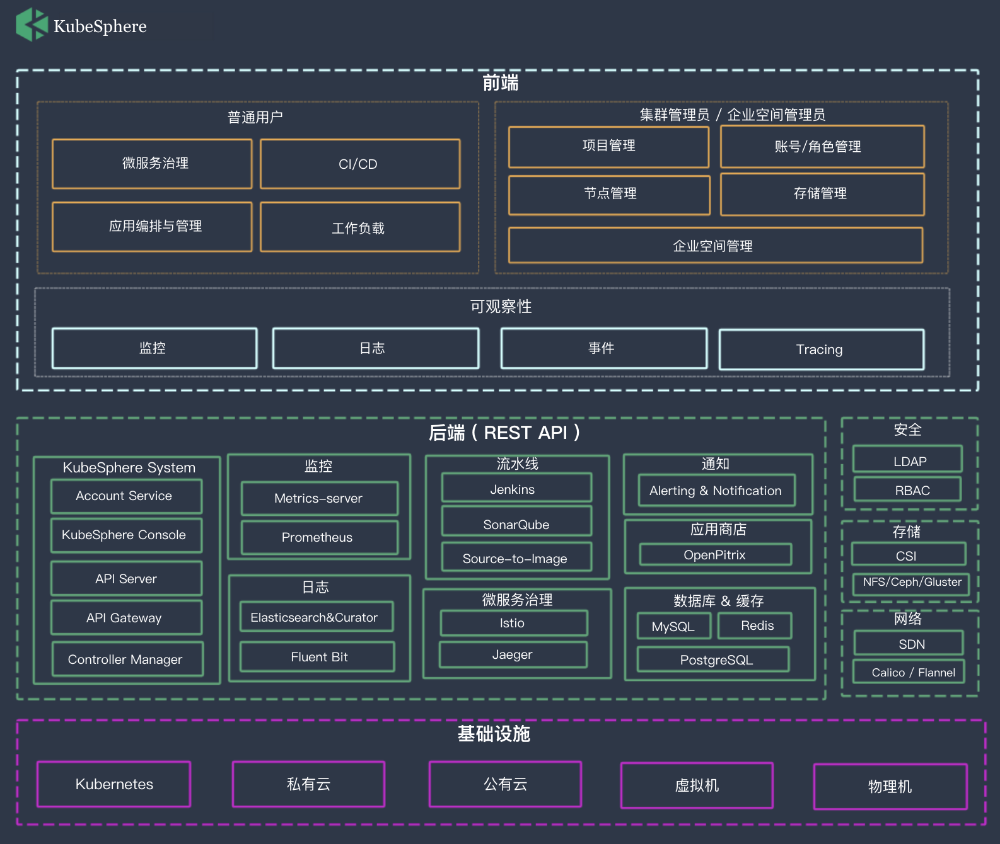

# KubeSphere
[](https://github.com/KubeSphere/KubeSphere/blob/master/LICENSE)
[](https://travis-ci.org/kubesphere/kubesphere)
[](https://github.com/kubesphere/kubesphere/releases/tag/advanced-2.0.2)


----

## KubeSphere 是什么

> [English](README.md) | 中文

[KubeSphere](https://kubesphere.io/) 是在 [Kubernetes](https://kubernetes.io) 之上构建的以**应用为中心的**多租户**容器管理平台**，支持部署和运行在**任何基础设施之上**，提供**简单易用的操作界面**以及**向导式操作**方式，在降低用户使用容器调度平台学习成本的同时，极大减轻开发、测试、运维的日常工作的复杂度，旨在解决 Kubernetes 本身存在的存储、网络、安全和易用性等痛点。帮助企业轻松应对**敏捷开发、自动化运维、应用快速交付、微服务治理、多租户管理、监控日志告警、服务与网络管理、镜像仓库**等业务场景。

KubeSphere 已大规模服务于社区用户，广泛地应用在以容器为中心的开发测试及生产环境，大量服务平稳地运行在 KubeSphere 之上。

> 说明：KubeSphere 目前最新的版本为高级版 2.0.2，并且所有版本 100% 开源，关于 KubeSphere 更详细的介绍与说明请参阅 [产品介绍](https://docs.kubesphere.io/advanced-v2.0/zh-CN/introduction/intro/)。


点击 [KubeSphere 快览](docs/en/guides/screenshots.md) 快速查看 KubeSphere UI；

<table>
  <tr>
      <td width="50%" align="center"><b>KubeSphere Dashboard</b></td>
      <td width="50%" align="center"><b>Project Resources</b></td>
  </tr>
  <tr>
     <td></td>
     <td></td>
  </tr>
  <tr>
      <td width="50%" align="center"><b>CI/CD Pipeline</b></td>
      <td width="50%" align="center"><b>Application Store</b></td>
  </tr>
  <tr>
     <td></td>
     <td></td>
  </tr>
</table>

## Video on Youtube

[](https://youtu.be/u5lQvhi_Xlc)

## 体验环境

使用体验账号 `demo1 / Demo123` 登录 [Demo 环境](https://demo.kubesphere.io/)，该账号仅授予了 viewer 权限，建议自行安装体验完整的管理功能。

## 核心功能

- Kubernetes 资源管理：纳管多种类型的 K8s 资源，提供易用友好的向导式 UI
- 应用编排与管理：包括**一键部署应用**、**Helm Chart 可视化管理**、**应用生命周期管理**，后续将支持计量计费
- 微服务治理：基于 Istio 提供可视化无代码侵入的**灰度发布、熔断、流量管控、Tracing**，兼容**Spring Cloud & Dubbo**
- 一站式 DevOps：提供**可视化编辑 CI/CD 流水线**，包括从开发测试到持续部署上线的**全流程管理**，提供 [S2i](https://kubesphere.io/docs/v2.0/zh-CN/quick-start/source-to-image/)、[B2i](https://kubesphere.io/docs/v2.1/zh-CN/quick-start/b2i-war/)
- 多租户管理：提供基于角色的细粒度 [多租户统一认证](https://kubesphere.io/docs/v2.1/zh-CN/multi-tenant/intro/)，支持**对接企业 LDAP/AD**，提供多层级的权限管理满足多组织架构的企业用户
- 日志查询与收集：提供基于多租户和多维度的 [日志查询](https://kubesphere.io/docs/v2.1/zh-CN/toolbox/log-search/)，并支持快速对接多种日志收集平台
- 多维度监控：提供集群与应用级别多项监控指标，提供按节点、企业空间、项目等资源用量的排行
- 多租户告警系统：支持基于多租户、多维度的告警，提供丰富的监控告警指标，可自定义告警策略，支持邮件通知
- 基础设施管理：提供主机管理、存储类型管理、CPU 与内存等资源配额管理
- 支持多种网络方案：支持 Calico、Flannel，提供面向物理部署 Kubernetes 的 LB 插件 [Porter](https://github.com/kubesphere/porter) 和云上[负载均衡器插件](https://github.com/yunify/qingcloud-cloud-controller-manager)
- 支持多种存储：支持 GlusterFS、CephRBD、NFS，支持 [企业级分布式存储 NeonSAN](https://www.qingcloud.com/products/qingstor-neonsan/) 和 [QingCloud 云平台块存储](https://docs.qingcloud.com/product/storage/volume/)
- 支持 GPU 节点


> 更多详细的功能解读与说明，请查阅 [产品功能](https://kubesphere.io/docs/v2.1/zh-CN/introduction/features/)。

----

## 架构

KubeSphere 采用了前后端分离的架构设计，后端的各个功能组件可通过 REST API 对接外部系统，KubeSphere 可以运行在任何 Kubernetes、私有云、公有云、VM 或物理环境之上。



## 最新发布

KubeSphere 2.1.0 已于 2019 年 11 月 12 日 正式发布，点击 [Release Notes For 2.1.0](https://kubesphere.io/docs/v2.1/zh-CN/release/release-v210/) 查看 2.1.0 版本的更新详情。

## 快速安装

### 部署在 Linux

- 操作系统
   - CentOS 7.5 (64 bit)
   - Ubuntu 16.04/18.04 LTS (64 bit)
   - Red Hat Enterprise Linux Server 7.4 (64 bit)
   - Debian Stretch 9.5 (64 bit)
- 配置规格（最低）
   - CPU：2 Core， 内存：4 G， 硬盘：100 G

#### All-in-One

[All-in-One](https://kubesphere.io/docs/v2.1/zh-CN/installation/all-in-one/): 对于首次接触 KubeSphere 高级版的用户，想寻找一个最快安装和体验 KubeSphere 高级版核心功能的方式，All-in-one 模式支持一键安装 KubeSphere 至一台目标机器，建议使用干净的机器安装。

```bash
$ curl -L https://kubesphere.io/download/stable/v2.1.0 > installer.tar.gz \
&& tar -zxf installer.tar.gz && cd kubesphere-all-v2.1.0/scripts
$ ./install.sh
```

直接选择 `"1) All-in-one"` 即可开始快速安装。

> 注意：All-in-One 仅适用于**测试体验**，**正式环境** 安装和使用请参考 [安装说明](https://kubesphere.io/docs/v2.1/zh-CN/installation/intro/#%E6%AD%A3%E5%BC%8F%E7%8E%AF%E5%A2%83%E5%AE%89%E8%A3%85)。

### 部署在 Kubernetes

**前提条件**

> - `Kubernetes` 版本： `1.13.0 ≤ K8s version < 1.16`；
> - `Helm`，版本 `>= 2.10.0`，且已安装了 Tiller，参考 [如何安装与配置 Helm](https://devopscube.com/install-configure-helm-kubernetes/)；
> - 集群的可用 CPU > 1 C，可用内存 > 2 G；且集群能够访问外网
> - 集群已有存储类型（StorageClass）；

可参考 [前提条件](https://kubesphere.io/docs/v2.1/zh-CN/installation/prerequisites/) 验证，若待安装的环境满足以上条件则可以开始部署 KubeSphere，当 KubeSphere 的所有 Pod 都为 RRunning 则说明安装成功。使用 `http://IP:30880` 访问 Dashboard，默认账号为 `admin/P@88w0rd`。

```yaml
$ kubectl apply -f https://raw.githubusercontent.com/kubesphere/ks-installer/master/kubesphere-minimal.yaml
```

注意，以上两种安装方式默认是 **最小化安装**，由于 2.1.0 已对大部分功能组件解耦，实现了功能组件的可插拔，因此可在 **安装完成后** 执行以下命令开启可插拔功能组件的安装，开启安装前确认您的机器资源已符合 [资源最低要求](https://kubesphere.io/docs/v2.1/zh-CN/installation/intro/#%E5%8F%AF%E6%8F%92%E6%8B%94%E5%8A%9F%E8%83%BD%E7%BB%84%E4%BB%B6%E5%88%97%E8%A1%A8)。

```
$ kubectl edit cm -n kubesphere-system ks-installer
```

## 开始使用 KubeSphere

### 快速入门

[KubeSphere 快速入门](https://kubesphere.io/docs/v2.1/zh-CN/quick-start/quick-start-guide/) 通过 14 个 Step-by-Step 的快速入门的示例教程帮助您了解 KubeSphere 容器平台的基本使用流程，带您快速上手 KubeSphere。

### 文档

- [KubeSphere 文档中心 (En/中) ](https://kubesphere.io/docs/)
- [API 文档](https://kubesphere.io/docs/advanced-v2.0/zh-CN/api-reference/api-docs/)


## 开发 KubeSphere

[开发指南](CONTRIBUTING.md) 详细说明了如何从源码编译、KubeSphere 的 GitHub 工作流、如何贡献代码以及如何测试等。


## 路线图

目前，KubeSphere 已发布了 4 个大版本和 3 个小版本，所有版本都是完全开源的，为 KubeSphere 社区用户提供服务。

**Express Edition** => **v1.0.x** => **v2.0.x**  => **v2.1.0**


## Landscapes

<p align="center">
<br/><br/>
&nbsp;&nbsp;&nbsp;&nbsp;
<br/><br/>
KubeSphere 是 CNCF 基金会成员并且通过了 <a href="https://www.cncf.io/certification/software-conformance/#logos">Kubernetes 一致性认证
</a>，进一步丰富了 <a href="https://landscape.cncf.io/landscape=observability-and-analysis&license=apache-license-2-0">CNCF 云原生的生态。
</a>
</p>

## 技术社区

- [Slack Channel](https://join.slack.com/t/kubesphere/shared_invite/enQtNTE3MDIxNzUxNzQ0LTZkNTdkYWNiYTVkMTM5ZThhODY1MjAyZmVlYWEwZmQ3ODQ1NmM1MGVkNWEzZTRhNzk0MzM5MmY4NDc3ZWVhMjE)

- [技术论坛](https://kubesphere.io/forum/)

- 微信群 (与工程师和用户们交流云原生技术，请备注 “公司 - 名字”）


## Bug 与建议反馈

KubeSphere 的日益完善与快速发展离不开社区用户的支持，KubeSphere 也一直在反哺社区，为开源用户提供更多的支持。若您安装使用时有任何建议问题、反馈或发现的 Bug，欢迎在 [GitHub Issue](https://github.com/kubesphere/kubesphere/issues) 提交 Issue。
