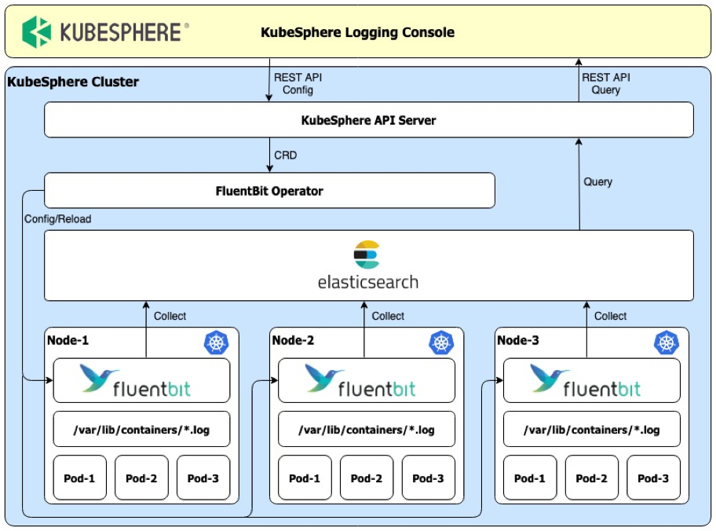
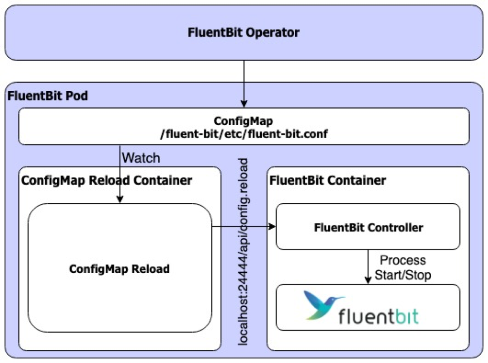

# KubeSphere Logging

## Overview

The KubeSphere logging system comprises many components that work together to achieve centralized log management. Once you enable the logging module during installation, a few components will be deployed or created within the namespace `kubesphere-logging-system`:

- Fluent Bit: log collector deployed on each node.
- Fluent-bit Operator: automates tasks for operating Fluent bit instances.
- Logsidecar Injector: injects sidecar into pods for streaming on-disk files to stdout.
- Elasticsearch Cluster: log storage backend.
- Curator: performs stale log cleanup.

The diagram below presents the overall logging architecture:

The following sections will detail the design and functionality of each component. 

## Log Collection and Forward

There are two types of logs produced by containers:

- stdout and stderr: written to `.log` files in the host's directory `/var/log/containers` by default.
- application logs: files on the pod's volume, file locations may vary. 

Fluent Bit serves as the logging agent. It can access host's container log directory and streams log files to stdout. In KubeSphere, we forked and modified the origin Fluent Bit project fluent/fluent-bit. The difference between fluent/fluent-bit and [kubesphere/fluent-bit](https://github.com/kubesphere/fluent-bit) is that we add a reload interface to support dynamic configuration (see issue [#365](https://github.com/fluent/fluent-bit/issues/365)).
 
As shown in the diagram below, Fluent-bit controller implements the reload interface and is responsible for the life cycle of fluent-bit process.

 

The approach to collect container logs on a pod's volume is using a log forwarder sidecar. The sidecar container forwards on-disk application logs to its own stdout. In this way, KubeSphere manages log collection in a unified manner. Besides, [Logsidecar Injector](https://github.com/kubesphere/logsidecar-injector) comes to automate sidecar injection. It takes advantages of `MutatingAdmissionWebhook` to control log forwarder sidecar injection during pod creation.

Though Fluent Bit sends log to Elasticsearch by default in KubeSphere, you may change its output via editing the custom resource defined by the CustomResourceDefinition `fluentbits.logging.kubesphere.io`. The custom resource holds Fluent Bit input/filter/output configurations. Once changes detected, [Fluent-bit operator](https://github.com/kubesphere/fluentbit-operator) will trigger reloading and the new configuration will be used. The Operator pattern is the encouraged way to implement declarative configuration in Kubernetes. 

## Log Store and Management

Fluent Bit supports a bunch of [output plugins](https://docs.fluentbit.io/manual/output) that you can choose from to configure how logs will be stored or forwarded. On KubeSphere console, you can easily setup [elasticsearch](https://docs.fluentbit.io/manual/output/elasticsearch), [kafka](https://docs.fluentbit.io/manual/output/kafka) and [fluentd](https://docs.fluentbit.io/manual/output/forward) as outputs.

Take Elasticsearch output for example. The default configuration writes that indices will be created daily with the prefix `ks-logstash-log`. It uses builtin Elasticsearch cluster whose address is `elasticsearch-logging-data.kubesphere-logging-system.svc`. For more details, please explore the custom resource `fluent-bit` (`kubectl get fluentbits.logging.kubesphere.io -n kubesphere-logging-system fluent-bit -oyaml`) .

To clean up stale logs, the Elasticsearch curator cronjob performs a daily check at the cluster level. See [Curator](https://www.elastic.co/guide/en/elasticsearch/client/curator/current/index.html) for more information.

## Log Search, Export and Visualization

KubeSphere wraps Elasticsearch Search and Scroll APIs to support multi-tenancy. Users can use KubeSphere console to search and analyze logs as well as exporting logs to files. 
