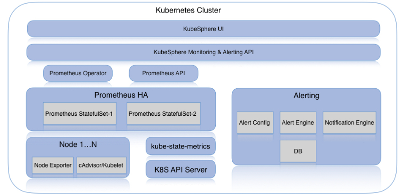

# KubeSphere Monitoring

## Overview

The KubeSphere monitoring system comprises many components that work together to achieve overall monitoring functionality. KubeSphere defaults to installing the monitoring module. It will deploy  or create a few components within the namespace `kubesphere-monitoring-system`:

- Prometheus Operator: automates tasks for operating Prometheus instances.
- Prometheus: scrapes metrics and provides monitoring service.
- Kube-state-metrics: exposes metrics for kubernetes objects like deployment, pod, namespace, etc.
- Node-exporter: exposes node metrics.

Besides, the monitoring stack includes CRD resources:

- ServiceMonitor: declaratively specifies how groups of services should be monitored.
- Prometheus: defines a desired Prometheus deployment.
- PrometheusRule: defines a desired Prometheus rule file.

In KubeSphere, Prometheus will monitor the following services by default: 

- kube-state-metrics
- node-exporter
- kubelet
- s2i-operator
- etcd
- coredns
- kube-apiserver
- kube-scheduler
- kube-controller-manager

## Setup

The [contrib/kube-prometheus](https://github.com/kubesphere/prometheus-operator/tree/ks-v0.27.0/contrib/kube-prometheus) folder provides manifests for setting up the monitoring stack. The [kubernetes-mixin/rules](https://github.com/kubesphere/kubernetes-mixin/blob/ks-v0.27.0/rules/rules.libsonnet) project provides recording rule templates. KubeSphere monitoring backend serves as Prometheus client performing metrics query.

The diagram below presents the overall monitoring architecture:

