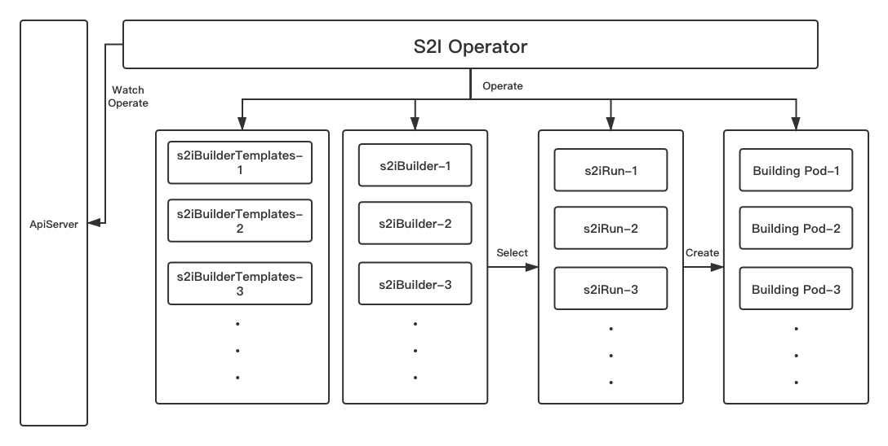

# KubeSphere S2I/B2I overview

## What is S2I/B2I

Kubesphere S2I(Source-to-Image) / B2I(Binary-to-Image) provides easy CI/CD functionalities, help developers to publish their service to Kubernetes without writing Dockefile.

## Workflow Example

## Principle

All resources of S2I/B2I will be installed in namespace `kubesphere-devops-system` by enable devops component.

In S2I, all resources and CI/CD steps are defined with [Custom Resource Defintion](https://kubernetes.io/docs/concepts/extend-kubernetes/api-extension/custom-resources/) (CRD). You can operate all s2i resources by call k8s api directly.

There are two mudules included in the S2I component:

1. S2I Operator: A Kubernetes CRD controller that provides easy Kubernetes-style resources for declaring CI/CD-style pipelines
2. S2IRun: It is the instance that executes the s2i build process in containers.

Besides, the S2I stack includes following CRD resources:

1. s2ibuildertemplates: defines information about S2I builder image.
2. s2ibuilders: all configuration information used in building are stored in this CRD.
3. s2iruns: defines an action about build

Here is a graph that describes the relationship about all CRD within S2I architecture:

​

Also you can install S2I component in any kubernetes cluster without KubeSphere.

Want to see more about s2i, please jump to [S2I Operator](https://github.com/kubesphere/s2ioperator) and [S2IRun](https://github.com/kubesphere/s2irun)
