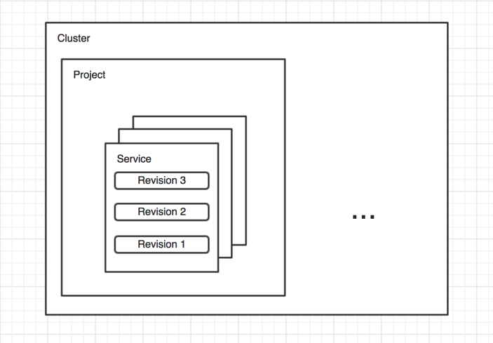
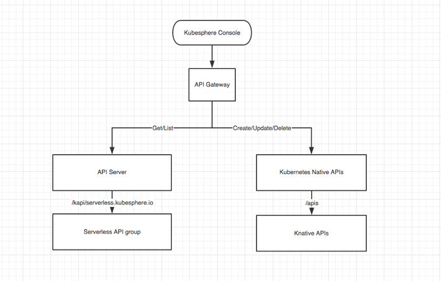

This document assumes reader has basic acknowledgements of Kubernetes and Knative. 

## Overview

Serverless on Kubesphere is mainly built on top of Knative, helping enterprises to adopt and distribute their applications as serverless services, reduce compute resources costs and take advantage of on-demand autoscalling. One particular use case may look like this:

> Enterprise user Any Scale Limited (we call it A below) run their services on Kubernetes and use Kubesphere to manage their Kubernetes cluster.
> 
> A has several dev teams working on different applications/services, having hundreds of micro services deployed in total. These micro services vary a lot on average workloads, some are barely invoked and some run periodically, but all take up pretty much compute resources. 
> 
> A is also exploring new markets which will grow fast though there might not be many users at the very beginning. Having all developers focusing on new functionalities, A is not really prepared for upcoming challenges. 
> 
> To achieve high utilization of resources and adapt itself to fast growth, A is looking for an aproach to adopt these services as serverless workloads and manage them in one place. 

(View [O'Reilly's survey](https://www.oreilly.com/radar/oreilly-serverless-survey-2019-concerns-what-works-and-what-to-expect/) for more stats.)

Serverless on Kubesphere aims to provide enterprise users:

- ability to setup serverless environment with ease using Kubesphere components management
- an universal interface to manage serverless workloads without concerning details about Knative
- automation of testing, developing & distributing processes with built-in devops integration
- detailed monitoring on resource usage for operators/cluster managers
- monitoring, tracing and logging for developers

and it does not intend to:

- try to optimize cold start issue (which should be done in Knative)
- make any modifications to Knative or other underlying components/services
- handle application configurations management or provide integrations


## Definition

`Project`. Kubesphere project(namespace), used to isolate user resources.

`Serverless service`. A serverless service is an entity created by user, it holds code/container information and configurations, handles scalling up and down to zero, provides service via domain name. Depending on how users organize their code, it may be a function or a set of APIs. 

`Revision`. A revision is a snapshot of user container & service configurations. It is automatically created and deleted when its service being created/updated/deleted. There may be many revisions existing and more than one revisions active receiving traffic.

> Actually `service` and `revision` are the same with corresponding Knative resources, but we hide `route` & `configuration` from user. Whenever user changes service configurations, a new revision is created. When user changes service traffic rules, user has no idea about underlying route changes.



## User Stories

| User Role | Title | Description | 
| --------- | ----- | ----------- |
| Operator/Cluster Manager | Operator can install Knative components | As an operator, or cluster manager, he can install and configure Knative components. |
| Operator/Cluster Manager | Operator can be aware of serverless resource usage | As an operator, or cluster manager, he can monitor and know current and historical cluster resource usage used by serverless services, including Knative control plane and workloads. |
| Developer | Developer can create new serverless  services | As a developer, he can create new serverless services. The service may have a name, may have information of code repository or container image, may have environment variables, volumes or domain names set. |
| Developer | Developer can update services | As a developer, he can update existing serverless services, he also can specify the traffic among new & existing versions of services (called revisions). | 
| Developer | Developer can switch between service revisions | As a developer, he can switch between different revisions of a serverless service, he also can specify the traffic rule among existing revisions. | 
| Developer | Developer can be aware of services' status | As a developer, he can monitor and know serverless services' current and historical status, status include number of active pods, number of requests (proccessing, processed), latency and so on.| 
| Developer | Developer can modify service scale behaviors | As a developer, he can specify the minimum & maximum number of pods, number of concurrent requests per pod, and maximum request concurrency for services. | 
| Developer | Developer can access services' logs and tracing records | As a developer, he can access services' logs and tracing records, no matter the services are active or not. | 

## Functionalities

| User Role | Group | Functionality | Description |
| --------- | ----- | ------------- | ----------- |
| Operator/Cluster Manager | Installation | Install Knative | Install Knative serving components via ks-installer |
| Operator/Cluster Manager | Configuration | Configure Knative | Configure Knative monitoring components via ks-installer |
| Operator/Cluster Manager | Configuration | Configure max revisions number | Configure max revisions number before they are deleted by GC |
| Operator/Cluster Manager | Monitoring | Monitor Knative control plane resource usage | Monitor Knative serving control plane resource usage: controller, autoscaler (kpa & hpa), activator, webhook |
| Operator/Cluster Manager | Monitoring | Monitor Knative user workloads resource usage | Monitor Knative user workloads resource usage, filter by: workspace, project, service, revision |
| Developer | Management | List serverless services | List serverless services within a project under the section of `projects - workloads - serverless` |
| Developer | Management | View serverless service details | View serverless service name, domain name, image, env, volumes, revisions, current traffic rules, etc. |
| Developer | Management | Create serverless service | Create a new serverless service within a project. Service name and container image must be specified, environment variables and all kinds of volumes can be set optionally. When service created, a FQDN should be generated. |
| Developer | Management | Update serverless service | User updates an existing serverless service by updating container image, environment variables or volumes. When service is updated, a new revision should be created while the old one is still there. If user does not configure traffic rules, all traffic go to the newest revision once ready. |
| Developer | Management | Shift traffic among revisions | User configures percent of traffic on serveral revisions within a service. Any revision can be selected as long as they are not GC'ed. (Revision traffic shifting still has to be done manually. The functionality of automatic shifting can only be achieved after monitoring and we will discuss about that later.) |
| Developer | Management | modify service scale behaviors | User configures whether service should scale to zero, minimum & maximum number of pods, number of concurrent requests per pod, target percent of concurrency per pod and maximum request concurrency. |
| Developer | Monitoring | Monitor serverless service workloads | Monitor number of active pods, number of active requests, number of proccessed requests, latency (max/min/avaerage/P95/P99), queue proxy stats and others | 
| Developer | Monitoring | Access serverless service logs and tracing records | Access serverless service logs from Kubesphere or Kibana, tracing records from jaeger UI. |

## API Designs

### Knative Components Installation

Help is needed.

### Serverless Service Management

Serverless service management apis follow Kubesphere common patterns:

- Listing and describing resources invoke Kubesphere kapi endpoints
- Resource creating, updating and deleting are done via Kubesphere apis, which proxy to Kubernetes native apis
- User authorization and authentication is done via Kubesphere APIGateway



#### 1. Listing services

`GET /kapis/resources.kubesphere.io/v1alpha2/namespaces/<namespace>/s8sservices`

Response example:

```
{
  "items": [
    {
      "kind": "Service",
      "apiVersion": "serving.knative.dev/v1beta1",
      "metadata": {
        "name": "go-sample",
        "namespace": "sandbox-ns",
        "selfLink": "/apis/serving.knative.dev/v1beta1/namespaces/sandbox-ns/services/go-sample",
        "uid": "2f6585d4-84ca-4294-bce9-6f6e6740e2dc",
        "resourceVersion": "589774",
        "generation": 1,
        "creationTimestamp": "2019-12-30T11:34:35Z",
      },
      "spec": {
        "template": {
          "metadata": {
            "creationTimestamp": null
          },
          "spec": {
            "containers": [
              {
                "name": "user-container",
                "image": "<image>",
                "env": [
                  {
                    "name": "CONTAINER_ENV",
                    "value": "Go Sample V1"
                  }
                ],
                "resources": {},
                "readinessProbe": {
                  "tcpSocket": {
                    "port": 0
                  },
                  "successThreshold": 1
                }
              }
            ],
            "containerConcurrency": 0,
            "timeoutSeconds": 300
          }
        },
        "traffic": [
          {
            "latestRevision": true,
            "percent": 100
          }
        ]
      }
    }
  ],
  "total_count": 1
}
```

#### 2. Creating new service

`POST /apis/serving.knative.dev/v1/namespaces/<namespace>/services`

Request example:

```
Content-Type: application/json

{
  "apiVersion": "serving.knative.dev/v1",
  "kind": "Service",
  "metadata": {
    "name": "go-sample",
    "namespace": "default"
  },
  "spec": {
    "template": {
      "spec": {
        "containers": [
          {
            "image": "<image>",
            "env": [
              {
                "name": "TARGET",
                "value": "Go Sample v1"
              }
            ]
          }
        ]
      }
    }
  }
}
```

#### 3. Updating service

> Updating service takes two steps: 
> 1. Create a new configuration which result in a new Knative revision
> 2. Specify traffic percentage for the new revision

1. `POST /apis/serving.knative.dev/v1/namespaces/<namespace>/configurations`

Request example:

```
Content-Type: application/json

{
  "apiVersion": "serving.knative.dev/v1",
  "kind": "Configuration",
  "metadata": {
    "name": "go-sample",
    "namespace": "default"
  },
  "spec": {
    "template": {
      "spec": {
        "containers": [
          {
            "image": "<image>",
            "env": [
              {
                "name": "TARGET",
                "value": "GO SAMPLE V2"
              }
            ]
          }
        ]
      }
    }
  }
}
```

2. `POST /apis/serving.knative.dev/v1/namespaces/<namespace>/routes`

Request example:

```
Content-Type: application/json

{
  "apiVersion": "serving.knative.dev/v1",
  "kind": "Route",
  "metadata": {
    "name": "go-sample",
    "namespace": "default"
  },
  "spec": {
    "traffic": [
      {
        "revisionName": "go-sample-cdt6p",
        "percent": 0,
        "tag": "v1"
      },
      {
        "revisionName": "go-sample-slwv5",
        "percent": 100,
        "tag": "v2"
      }
    ]
  }
}
```


### Monitoring

Knative provides monitoring support via Prometheus and Grafana, which have already been integrated into Kubesphere. All we have to do is to configure monitoring properly.

Knative control plane components (controller, activator, autoscaler, webhook) expose metrics via HTTP endpoints, enabling Prometheus to scrape metrics automatically.

User containers metrics are exported via Knative queue proxy sidecar HTTP endpoint. Metrics include request process time, request count, status code, queue depth.

With the help of Kubernetes service discovery mechanism, Prometheus can easily discover Knative control plane and workloads.

#### Prometheus Configurations

View [Knative Prometheus configs](https://github.com/knative/serving/tree/master/config/monitoring/metrics/prometheus).

#### Grafana Dashboards

TODO.

#### Tracing

TODO.

#### Logging

By default Knative uses fluentd daemon set to collect and forward logs to ElasticSearch. TODO.

### Devops Integration

TODO.