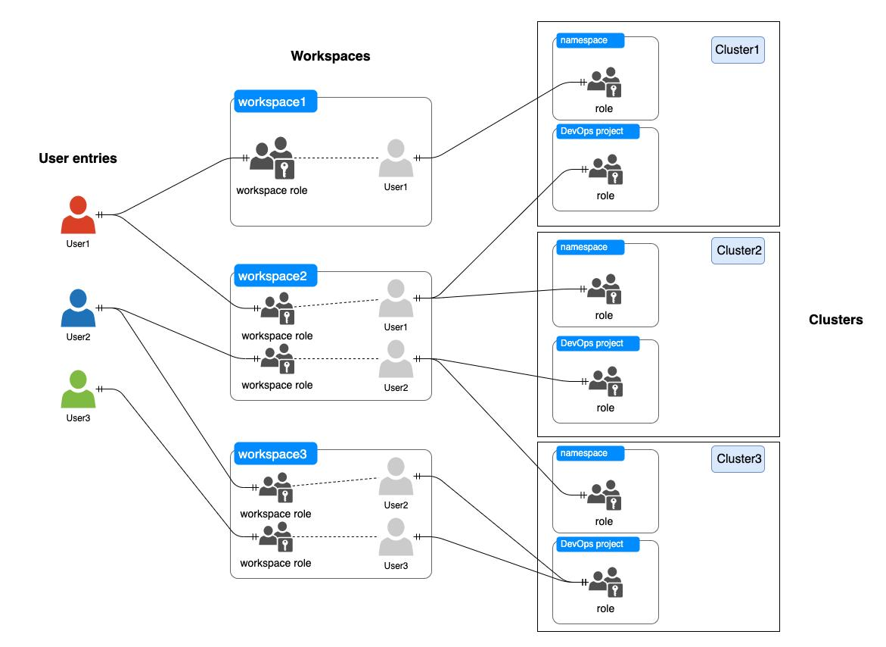

Kubernetes helps you orchestrate applications and schedule containers, greatly improving resource utilization. However, there are various challenges facing both enterprises and individuals in resource sharing and security as they use Kubernetes, which is different from how they managed and maintained clusters in the past.

The first and foremost challenge is how to define multi-tenancy in an enterprise and the security boundary of tenants. [The discussion about multi-tenancy](https://docs.google.com/document/d/1fj3yzmeU2eU8ZNBCUJG97dk_wC7228-e_MmdcmTNrZY) has never stopped in the Kubernetes community, while there is no definite answer to how a multi-tenant system should be structured.

## Challenges in Kubernetes Multi-tenancy

Multi-tenancy is a common software architecture. Resources in a multi-tenant environment are shared by multiple users, also known as "tenants", with their respective data isolated from each other. The administrator of a multi-tenant Kubernetes cluster must minimize the damage that a compromised or malicious tenant can do to others and make sure resources are fairly allocated.

No matter how an enterprise multi-tenant system is structured, it always comes with the following two building blocks: logical resource isolation and physical resource isolation.           

Logically, resource isolation mainly entails API access control and tenant-based permission control. [Role-based access control (RBAC)](https://kubernetes.io/docs/reference/access-authn-authz/rbac/) in Kubernetes and namespaces provide logic isolation. Nevertheless, they are not applicable in most enterprise environments. Tenants in an enterprise often need to manage resources across multiple namespaces or even clusters. Besides, the ability to provide auditing logs for isolated tenants based on their behavior and event queries is also a must in multi-tenancy.

The isolation of physical resources includes nodes and networks, while it also relates to container runtime security. For example, you can create NetworkPolicy resources to control traffic flow and use PodSecurityPolicy objects to control container behavior. [Kata Containers](https://katacontainers.io/) provides a more secure container runtime.

## Kubernetes Multi-tenancy in KubeSphere

To solve the issues above, KubeSphere provides a multi-tenant management solution based on Kubernetes.

In KubeSphere, the workspace is the smallest tenant unit. A workspace enables users to share resources across clusters and projects. Workspace members can create projects in an authorized cluster and invite other members to cooperate in the same project.

A **user** is the instance of a KubeSphere account. Users can be appointed as platform administrators to manage clusters or added to workspaces to cooperate in projects.

Multi-level access control and resource quota limits underlie resource isolation in KubeSphere. They decide how the multi-tenant architecture is built and administered.

### Logical isolation

Similar to Kubernetes, KubeSphere uses RBAC to manage permissions granted to users, thus logically implementing resource isolation.

The access control in KubeSphere is divided into three levels: platform, workspace and project. You use roles to control what permissions users have at different levels for different resources.

1. Platform roles: Control what permissions platform users have for platform resources, such as clusters, workspaces and platform members.
2. Workspace roles: Control what permissions workspace members have for workspace resources, such as projects (i.e. namespaces) and DevOps projects.
3. Project roles: Control what permissions project members have for project resources, such as workloads and pipelines.

### Network isolation

Apart from logically isolating resources, KubeSphere also allows you to set network isolation policies for workspaces and projects.
